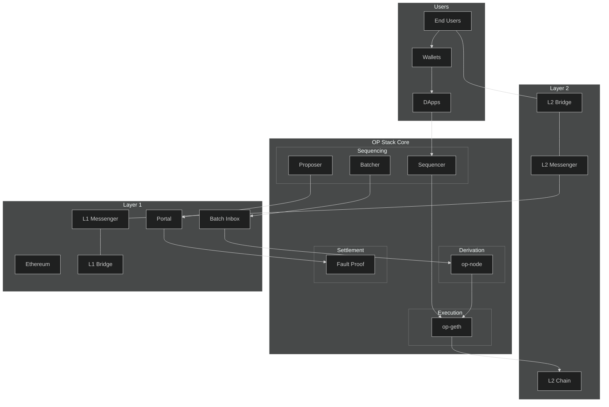

# Optimism-Stack-Architecture
Optimism Stack (OP Stack) is a modular architecture for building L2 blockchain solutions.

## User Flow
### Standard L2 Transaction Path
- ``End Users -> Wallets -> DApps -> Sequencer -> op-geth -> L2 Chain``
- Users interact through Optimism-supported wallets (e.g., MetaMask)
- Interact with DApps on L2
- Transactions are sent to Sequencer for ordering
- op-geth executes transactions and updates L2 state
### Cross-chain Bridge Path
- ``End Users -> L2 Bridge -> L2 Messenger -> L1 Messenger -> L1 Bridge``
- Users can transfer assets between L1 and L2
- Bridge contracts handle asset locking/releasing
- Messenger system ensures reliable cross-chain communication

## OP Stack Core Components
### Sequencing Layer
- Sequencer: Receives and orders user transactions
- Batcher: Submits transaction batches to L1
- Proposer: Submits L2 state updates to L1
### Execution Layer
- Modified Ethereum client
- Executes transactions and maintains L2 state
- Ensures EVM compatibility
### Derivation Layer
- op-node: Reconstructs L2 state from L1 data
- Ensures state consistency
- Drives execution engine
### Settlement Layer
- Fault Proof: Ensures correct state transitions
- Allows challenges to incorrect states

## Layer 1 Components
- Batch Inbox: Receives batched transaction data
- Portal: Manages cross-chain operations
- Bridge: Handles asset bridging
- Messenger: Processes cross-chain messages

## Layer 2 Components
- L2 Chain: Maintains L2 state
- L2 Bridge: Handles L2-side bridging
- L2 Messenger: Processes L2-side messages

## Data Flow
### Transaction Processing Flow
- User transactions -> Sequencer
- Sequencer -> op-geth
- op-geth -> L2 state update
### Batch Processing Flow
- Batcher -> L1 Batch Inbox
- op-node reads data from L1
- Drives op-geth state updates
### State Validation Flow
- Proposer submits state to Portal
- Validation through Fault Proof system
- Ensures state correctness

