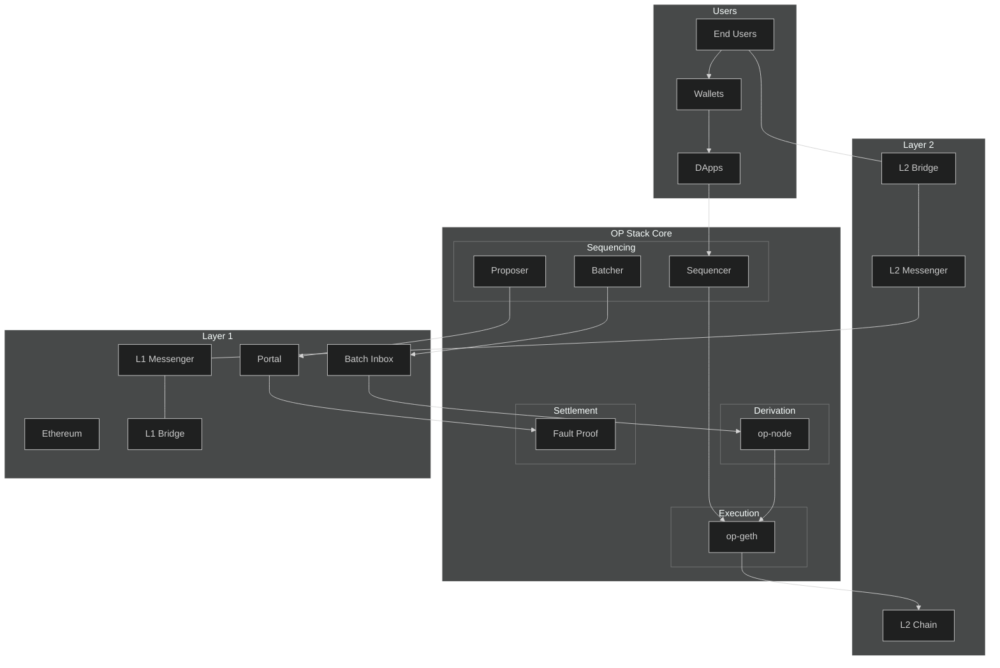

# Optimism-Stack-Architecture
Optimism Stack Architecture

## User Flow
### Standard L2 Transaction Path
- ``End Users -> Wallets -> DApps -> Sequencer -> op-geth -> L2 Chain``
- Users interact through Optimism-supported wallets (e.g., MetaMask)
- Interact with DApps on L2
- Transactions are sent to Sequencer for ordering
- op-geth executes transactions and updates L2 state
### Cross-chain Bridge Path
- ``End Users -> L2 Bridge -> L2 Messenger -> L1 Messenger -> L1 Bridge``
- Users can transfer assets between L1 and L2
- Bridge contracts handle asset locking/releasing
- Messenger system ensures reliable cross-chain communication

