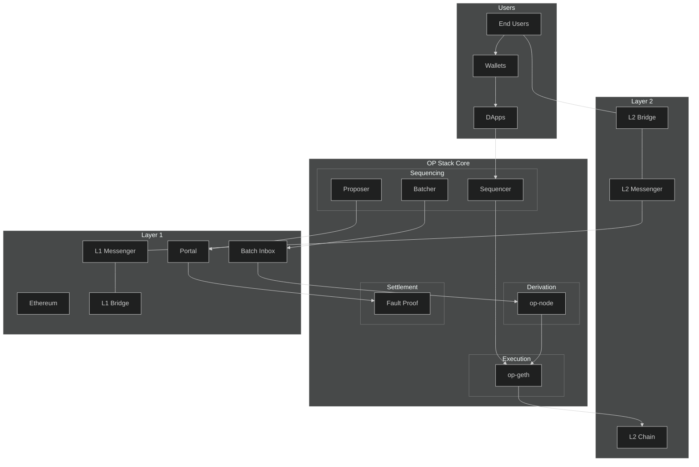

# Optimism-Stack-Architecture
Optimism Stack Architecture

```mermaid
%%{init: {'theme': 'dark', 'themeVariables': { 'fontSize': '16px', 'fontFamily': 'arial' }}}%%
graph TB
    subgraph Users[Users]
        End[End Users]
        Apps[DApps]
        Wallet[Wallets]
    end

    subgraph L2[Layer 2]
        Chain[L2 Chain]
        Bridge2[L2 Bridge]
        Msg2[L2 Messenger]
    end

    subgraph Core[OP Stack Core]
        direction TB
        
        subgraph SL[Sequencing]
            Seq[Sequencer]
            Batch[Batcher]
            Prop[Proposer]
        end
        
        subgraph EL[Execution]
            Geth[op-geth]
        end
        
        subgraph DL[Derivation]
            Node[op-node]
        end

        subgraph ST[Settlement]
            Proof[Fault Proof]
        end
    end

    subgraph L1[Layer 1]
        Eth[Ethereum]
        Inbox[Batch Inbox]
        Portal[Portal]
        Bridge1[L1 Bridge]
        Msg1[L1 Messenger]
    end

    %% User Normal Transaction Flow
    End --> Wallet
    Wallet --> Apps
    Apps --> Seq
    Seq --> Geth
    Geth --> Chain

    %% Batch Processing Flow
    Batch --> Inbox
    Node --> Geth
    Prop --> Portal

    %% Bridge Flow
    End --- Bridge2
    Bridge2 --- Msg2
    Msg2 --- Msg1
    Msg1 --- Bridge1

    %% Verification
    Portal --> Proof
    
    %% L1 Data
    Inbox --> Node
```
